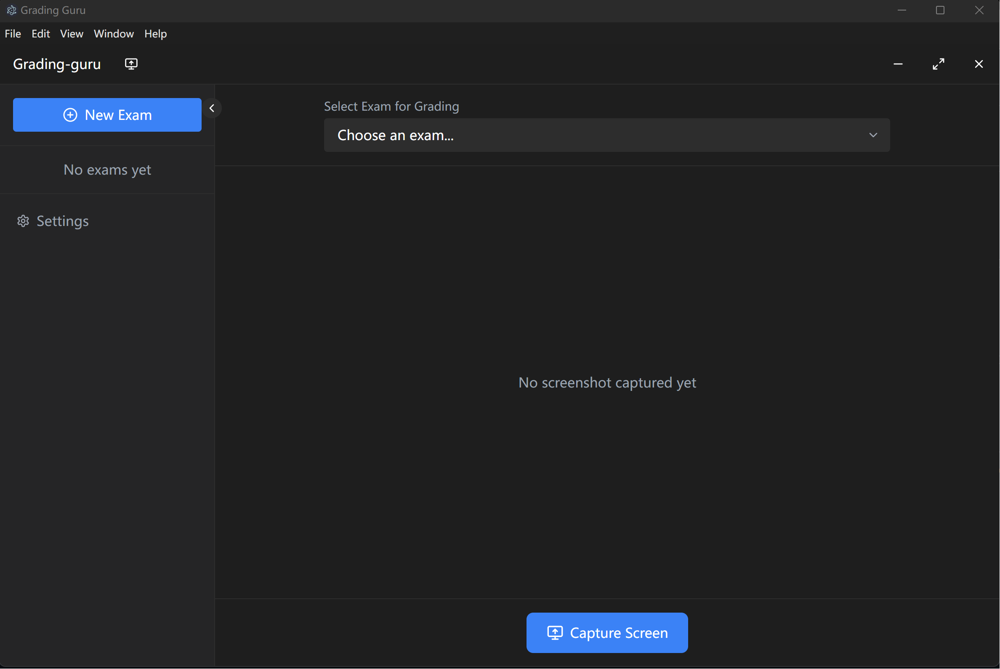

# AI-Powered Exam Grading Assistant

A modern desktop application built with Electron, React, and TypeScript that helps educators grade exams using AI assistance and screen capture technology.



## Features

### 🎯 Key Features
- **Smart Screen Capture**: Advanced screen selection tool with precise region capture
- **Real-time Analysis**: Instant feedback on student answers with detailed scoring
- **Flexible Grading Criteria**: Customizable grading schemas and rubrics
- **Visual Feedback**: Clear visualization of grading results and feedback

### 💡 AI Integration
- OpenAI GPT-4 integration for advanced answer analysis
- Local ONNX model support for offline grading (Comming Soon)
- Configurable AI settings and model selection
- Detailed confidence scores and reasoning

### 🖥️ User Interface
- Modern, intuitive React-based interface
- Dark mode support
- Responsive design with customizable layouts
- Real-time preview and editing capabilities

## Installation

```bash
# Clone the repository
git clone https://github.com/HongBo713/grading-guru.git

# Navigate to project directory
cd grading-guru

# Install dependencies
npm install

# Start the development server
npm run dev
```

## Configuration

### AI Provider Setup

1. **OpenAI Configuration**
   - Obtain an API key from OpenAI
   - Configure in the settings panel
   - Select preferred model

### Application Settings

Configure the application through the settings panel:
- AI provider selection
- Model preferences
- Grading criteria
- Interface preferences

## Usage

1. **Capture Answer**
   - Click "Start Capture"
   - Select screen region containing student's answer
   - Preview and confirm capture

2. **Grade Answer**
   - Select appropriate grading criteria
   - Click "Grade with AI"
   - Review AI analysis and scores

3. **Review and Adjust**
   - Examine detailed feedback
   - Adjust scores if needed
   - Save final grade

## Development

### Tech Stack
- Electron
- React
- TypeScript
- TailwindCSS
- ONNX Runtime
- OpenAI API

### Project Structure
```
├── src/
│   ├── main/           # Electron main process
│   ├── renderer/       # React frontend
│   ├── preload/        # Preload scripts
│   └── types/          # TypeScript definitions
├── public/             # Static assets
└── dist/              # Compiled files
```

### Building

```bash
# Build for production
npm run build

# Create distributable
npm run dist
```

## Contributing

Contributions are welcome! Please read our [Contributing Guide](CONTRIBUTING.md) for details on our code of conduct and the process for submitting pull requests.

## License

This project is licensed under the MIT License - see the [LICENSE](LICENSE) file for details.

## Acknowledgments

- OpenAI for GPT-4 API
- Electron community
- React development team

## Support

For support, please open an issue in the GitHub repository or contact the maintenance team.

---

**Note**: This project is under active development. Features and documentation may change frequently.
